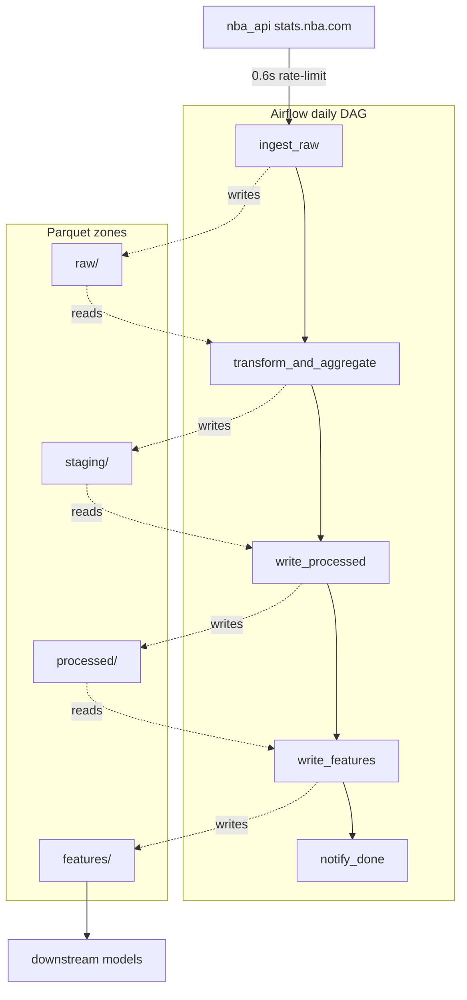

# nba-parquet

> **A daily PySpark + Airflow pipeline that turns NBA box scores into model-ready trailing-window features.**


[](https://github.com/tjromack/nba-parquet/actions/workflows/ci.yml)


> 📋 **Need to explain this project to someone?** See [`docs/PROJECT_QA.md`](docs/PROJECT_QA.md) — the same six questions answered in both technical and layman terms, plus 30-second / 2-minute / 30-minute pitches.
>
> 🎤 **Interview prep**: [`docs/PORTFOLIO_ANECDOTES.md`](docs/PORTFOLIO_ANECDOTES.md) collects real moments from building this — retry recovery, a column-name regression, ESPN reconciliation, the Docker parallel-build race fix — each one a calibrated 30-second story.
>
> 📊 **Live dashboard**: `streamlit run streamlit_app.py` reads the pipeline's output directly and surfaces a leaderboard, per-team rolling trends, head-to-head comparisons, and a filterable data explorer. See the [Live dashboard](#live-dashboard) section below.

## Demo at a glance

Validated end-to-end against the 2025–26 NBA playoffs. The leaderboard below is the live Streamlit dashboard reading directly off the pipeline's `features/` Parquet zone, sorted by trailing 10-game true-shooting %. Inline bars on TS% and win rate scale to the column leader so the gap between the top team and the rest is visible at a glance:


OKC's perfect win rate over a 6-game stretch and NYK's 9-game .622 efficiency lead the field; cross-checks against ESPN confirm the row counts and series records match reality. These are exactly the trailing-window signals a survivor / spread / total prediction model would consume downstream.

## What / Why / How / For Whom

- **What it does.** A daily Airflow DAG ingests NBA box scores from `nba_api`, aggregates them with PySpark into team-game stats (eFG%, true shooting %, AST/TOV, win flag), and writes partitioned Parquet to S3 — then engineers rolling 10-game features (`rolling_ts_pct`, `rolling_win_pct`, home/away split) ready for downstream prediction models.
- **Why it exists.** Sports-analytics prediction models (survivor pools, spreads, totals) need clean, aggregated, time-windowed signal. This pipeline replaces ad-hoc pandas notebooks with a real data platform: schema-typed, idempotent, partition-aware, daily-orchestrated, retry-safe.
- **How it's built.** Five-task Airflow DAG (`ingest_raw → transform_and_aggregate → write_processed → write_features → notify_done`), `LocalExecutor` on Postgres, staging-then-promote Parquet writes with **dynamic partition overwrite**, dual-mode destination (S3A or local disk via `LOCAL_OUTPUT_DIR`), and 25 unit tests covering schema, math, partitioning, and DAG load-time guard rails.
- **For whom.** Sports-analytics teams who want a model-ready feature layer fed nightly; data-engineering hiring managers reviewing portfolio work; future-me who needs to remember why the staging-then-promote pattern is there. Also a reusable template for any "ingest API → transform → partitioned warehouse" use case (NFL, MLB, fantasy, etc.).

## Skills demonstrated

Each row points at a specific file or function so reviewers can verify the claim, not just take my word for it.

| Skill | Where to look |
|---|---|
| PySpark `Window` functions over `partitionBy + orderBy + rowsBetween` for trailing-window features | [`etl/features.py`](etl/features.py) |
| Conditional aggregation within a window (home/away split) | [`etl/features.py`](etl/features.py) `pts_home_only` / `pts_away_only` |
| Idempotent partitioned Parquet writes via `partitionOverwriteMode=dynamic` | [`etl/transform.py`](etl/transform.py) `get_spark()` |
| Airflow DAG design with lazy imports, XCom path-passing, `max_active_runs=1`, `catchup=False` | [`dags/nba_etl_dag.py`](dags/nba_etl_dag.py) |
| Production staging → canonical promotion pattern | DAG `transform_and_aggregate` → `write_processed` tasks |
| Schema-first ingestion with `StructType` (no `inferSchema=True` on production paths) | [`etl/schema.py`](etl/schema.py), [`etl/ingest.py`](etl/ingest.py) |
| API rate-limit handling (`stats.nba.com`) | [`etl/ingest.py`](etl/ingest.py) `_rate_limit_sleep` |
| Real-data correctness reconciliation | Phase 3 commit message — caught NYK 4-2 vs ATL gap, patched with single-day backfill |
| Docker Compose multi-service stack with single-build-owner pattern (avoids parallel image-export race) | [`infra/docker-compose.yml`](infra/docker-compose.yml) |
| Custom Airflow image extending `apache/airflow` with OpenJDK 17 for PySpark local mode | [`infra/Dockerfile.airflow`](infra/Dockerfile.airflow) |
| Static guard-rail tests for DAG hygiene (no heavy module-level imports) | [`tests/test_dag.py`](tests/test_dag.py) |
| Cross-platform dev (Windows + Linux containers) — bind-mounted code, vendored Hadoop winutils, dual S3/local destination | [`tests/conftest.py`](tests/conftest.py), [`etl/paths.py`](etl/paths.py) |

---

## Architecture



Column counts, row grain, and partitioning for each zone live in the schema table immediately below — no need to repeat them on the diagram.

**Schema dimensions at each layer:**

| Layer | Cols | Row grain | Partitioning | Source / produced by |
|---|---|---|---|---|
| `raw/` | 27 | one per (player, game) | `season` + `game_date` | `nba_api.BoxScoreTraditionalV2` |
| `staging/` | 22 | one per (team, game) | `run_date` | `transform_and_aggregate` task (transient) |
| `processed/` | 22 | one per (team, game) | `season` + `game_date` | `write_processed` task (canonical) |
| `features/` | 13 | one per (team, game) | `season` | `write_features` task (10-game rolling) |

The staging → processed promotion is a real production pattern: the transform task can fail and retry without ever touching the canonical output, and a successful staging write commits atomically when `write_processed` reads it back and writes the canonical partition. Combined with `partitionOverwriteMode=dynamic`, daily backfills only touch the partitions they own.

---

## Results & Metrics

Numbers from the live pipeline run, accumulated through 2026-05-03 (16 days of 2025–26 NBA playoff data).

### Validation run

| Metric | Value |
|---|---|
| Date range covered | 2026-04-18 → 2026-05-03 |
| Distinct game days ingested | 16 |
| Games captured | 48 |
| Unique teams seen | 16 |
| Raw player-game rows | 1,347 |
| Processed team-game rows | 96 |
| Feature rows (rolling) | 96 |
| Mean rows per game day | 6.0 (range 2–8 depending on slate) |
| Mean Airflow run duration | 1:11 per day-instance |
| 14-day backfill total wall-clock | ~16 minutes (sequential, `max_active_runs=1`) |
| Backfill task instances | 70 / 70 succeeded, 0 failed, 0 retried |
| Test suite | 25 passed, 1 skipped in 21.7s (zero AWS, zero network access) |
| Hot path failures during validation | 0 |
| Real-data correctness regressions caught | 2 (`TO`→`tov` rename, partition-overwrite mode) |

### Top of leaderboard (through 5/3)

Sorted by trailing 10-game true-shooting %:

| Team | games in window | rolling pts | rolling TS% | rolling win% |
|---|---|---|---|---|
| OKC | 4 | 122.75 | .614 | 1.000 |
| NYK | 6 | 117.83 | .609 | .667 |
| SAS | 5 | 112.40 | .596 | .800 |

OKC's .614 TS% on a 4-0 stretch is exactly the trailing-window signal a survivor / spread / total prediction model would weight heavily. NYK's 4-2 over six games matches their actual round-1 series result vs ATL — cross-reconciles against the public schedule, not just internally.

---

## Quick Start

### Verify in 60 seconds (no AWS, no Docker, no `.env`)

Three commands and a green test suite — designed for reviewers who want to confirm the project actually works before reading further:

```bash
git clone https://github.com/tjromack/nba-parquet.git
cd nba-parquet
pip install -r requirements.txt -r requirements-dev.txt
pytest tests/ -m "not integration"
# expected: 25 passed, 1 skipped in ~22s
```

The full 25-test suite runs on a local `SparkSession` against bundled fixtures — no network calls, no AWS credentials, no Docker. The single skipped test is the Airflow-load smoke check; it activates only when `apache-airflow` is installed locally.

### Full setup — running the pipeline

#### Prerequisites
- Python 3.11+
- Docker + Docker Compose (for Airflow)
- Java 11+ (for PySpark local mode)
- AWS account with an S3 bucket — or [LocalStack](https://localstack.cloud/) for fully offline dev

### 1. Clone & configure
```bash
git clone https://github.com/you/nba-parquet.git
cd nba-parquet
cp .env.example .env
# Edit .env: set S3_BUCKET, AWS credentials (or AWS_ENDPOINT_URL for LocalStack)
```

### 2. Install dependencies
```bash
make setup
```

### 3. Run the ETL locally (no Airflow needed)
```bash
make run-local
# Reads NBA_SEASON + NBA_INGEST_DATE from .env, runs full pipeline, writes to S3/LocalStack
```

### 4. Run tests
```bash
make test
# Zero AWS credentials and zero network access required — uses local fixtures
```

### 5. Start Airflow (Docker Compose)
First-time setup:
```bash
cp infra/airflow.env.example infra/airflow.env
# (optional) generate a real Fernet key and paste it into airflow.env:
python -c "from cryptography.fernet import Fernet; print(Fernet.generate_key().decode())"

make airflow-up        # builds the image, starts postgres + scheduler + webserver
# First boot takes 5-10 minutes (image pull + pip install + db migrate).
# Subsequent boots are seconds.
```
Open http://localhost:8080 and log in with `admin` / `admin`. The
`nba_etl_pipeline` DAG appears paused — toggle it on, then trigger a run
from the UI or via:
```bash
make trigger-dag
```
The DAG runs against the same `./out/` directory the local pipeline
writes to (mounted into the container as `/opt/airflow/out`), so you can
inspect output with:
```bash
.venv/Scripts/python.exe -c "import pandas as pd; print(pd.read_parquet('./out/processed/nba/team_game_stats/'))"
```

Useful commands:
```bash
make airflow-logs      # tail the scheduler + webserver logs
make dag-list          # list any DAG import errors
make airflow-rebuild   # rebuild the image after editing requirements.txt or Dockerfile
make airflow-down      # stop the stack
```

### Daily catch-up during the season

The DAG is `@daily` with `catchup=False`, so if the scheduler is down at trigger
time (laptop off, Docker stopped) it won't auto-fill missed days. To stay
current, run the catch-up helper each morning:

```powershell
.\scripts\catch_up.ps1
```

It auto-detects the latest `game_date` partition under `out/processed/`, brings
up the Airflow stack if needed, and backfills every day from `(latest + 1)` through
yesterday. Idempotent — safe to re-run any time.

If a previous run crashed and left a DagRun stuck in `running` state (which would
block new runs because of `max_active_runs=1`), pass `-CleanStale` to auto-mark
the stale runs failed via Airflow's REST API before submitting work:

```powershell
.\scripts\catch_up.ps1 -CleanStale
```

Override the range explicitly with `-From 2026-04-18 -To 2026-05-15` for cold
starts or wider catch-ups. Default `-CleanStale` is off — the script warns
and exits with instructions if it detects stale runs without the flag, so
you don't accidentally clobber a legitimate-but-slow run.

---

## Live dashboard

A Streamlit app reads the pipeline's `processed/` and `features/` Parquet zones
directly and exposes four views:

- **Leaderboard** — latest rolling-feature snapshot per team, sorted by trailing
  TS%, with color gradients on TS% and win rate so hot/cold teams pop at a glance
- **Team detail** — pick any team, see their rolling pts / TS% / win rate over
  time as line charts, plus a sortable game-by-game results table
- **Head-to-head** — pick any two teams, get a side-by-side metric comparison
  plus their rolling-window trajectories overlaid
- **Data explorer** — filterable view of the raw processed layer for spot-checks
  against external sources like ESPN

### Run it locally

```powershell
# from the repo root, with .venv activated and pipeline data in ./out/
streamlit run streamlit_app.py
```

Streamlit opens at http://localhost:8501. The app reads from
`$env:LOCAL_OUTPUT_DIR` if set, otherwise falls back to `./out` — same env-var
contract as the pipeline itself, so whatever data the most recent
`scripts/run_local.py` or `scripts/catch_up.ps1` invocation produced is
immediately visible.

### Deploying publicly (optional)

Streamlit Cloud (https://streamlit.io/cloud) hosts apps from public GitHub repos
on a free tier. To deploy this app there:

1. Make the repo public (or use a Streamlit Cloud paid tier for private repos)
2. Bundle a snapshot of `out/processed/` and `out/features/` into the repo so
   the cloud-hosted app has data to render (current `out/` is gitignored)
3. Connect the repo at https://share.streamlit.io and point at
   `streamlit_app.py`

For now the app is local-run only — pairing the live pipeline output with a
public dashboard is a Phase 4-adjacent decision (involves data publication).

---

## Output Schema

**Processed layer** — `team_game_stats` (one row per team per game):
| Column | Type | Description |
|---|---|---|
| season | int | NBA season start year (e.g. 2025 for 2025-26) |
| game_date | date | Date the game was played |
| game_id | string | nba_api game identifier |
| season_type | string | "Regular Season" or "Playoffs" |
| team_abbreviation | string | e.g. "BOS", "LAL" |
| opponent_abbreviation | string | Opponent team abbreviation |
| is_home | boolean | True if team played at home |
| win | boolean | True if team won |
| pts | int | Points scored |
| effective_fg_pct | double | (FGM + 0.5 * 3PM) / FGA |
| true_shooting_pct | double | PTS / (2 * (FGA + 0.44 * FTA)) |
| assist_to_turnover | double | AST / TOV |
| top_scorer | string | Player with most points for the team in this game |

**Feature layer** — `rolling_team_stats` (one row per (team, game), partitioned by `season`):
| Column | Type | Description |
|---|---|---|
| games_in_window | int | Actual lookback size (1–10; smaller for early-season games) |
| rolling_pts | double | Avg points over last 10 games |
| rolling_efg_pct | double | Avg effective FG% over last 10 games |
| rolling_ts_pct | double | Avg true shooting % over last 10 games |
| rolling_ast_to_tov | double | Avg AST/TOV ratio over last 10 games |
| rolling_win_pct | double | Win fraction over last 10 games |
| rolling_pts_home | double | Avg points in home games within the window (NULL if none) |
| rolling_pts_away | double | Avg points in away games within the window (NULL if none) |

---

## Tech Stack

| | |
|---|---|
| **PySpark 3.5** | Distributed batch processing (local mode for dev, EMR-compatible) |
| **Apache Airflow 2.9** | DAG orchestration via Docker Compose |
| **AWS S3** | Parquet storage (Hadoop S3A connector) |
| **nba_api** | Free, official-endpoint NBA stats source |
| **pytest** | Unit tests with local SparkSession |
| **LocalStack** | Optional: fully offline S3 emulation |

---

## How the pipeline behaves under load

Three more views from the validation run, each showing a different part of the architecture working:

**Per-game ETL — scripted local run for the 4/29 playoff slate.** Proves the schema math (eFG%, TS%, AST/TOV, top scorer per team) holds against real `nba_api` data:


**Airflow DAG graph — five tasks green on an autonomous run** triggered by the scheduler (no manual click):


**14-day playoff backfill via `airflow dags backfill 2026-04-19 2026-05-02`** — 70/70 task instances succeeded, mean run duration 1:11. This is what convinced me dynamic partition overwrite was working: each daily run touched only its own `(season, game_date)` partition without clobbering the rest:


---

## Project Status

- [x] Phase 1 — Core ETL (ingest → transform → S3 write)
- [x] Phase 2 — Airflow DAG + Docker Compose
- [x] Phase 3 — Feature engineering + rolling windows
- [ ] Phase 4 — Cloud deploy (EC2/EMR) + IAM hardening
- [ ] Phase 5 — Docs, demo, CI/CD

---

## License

MIT — see [LICENSE](LICENSE)
